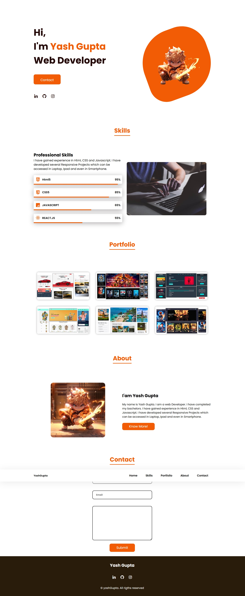

# 👨‍💻 Sample Portfolio Website

A modern and responsive personal portfolio website built using HTML, CSS. It showcases a developer’s profile, skill set, projects, and contact information — ideal for job applications, freelancing, and building a strong web presence.

## 🔗 Live Demo
👉 [View Live Site](https://yashgupta7373.github.io/Sample-Portfolio/)

## 📂 GitHub Repository
👉 [GitHub Repo](https://github.com/yashgupta7373/Sample-Portfolio)

## 🛠️ Tech Stack
- HTML5
- CSS3

## 📸 Screenshot


## ✨ Features
- Fully responsive design (mobile, tablet, and desktop)
- Smooth scrolling and modern UI components
- Interactive navigation bar
- Professionally structured layout

## 📁 Sections Included
- **Home** – Brief intro with call-to-action
- **About** – Personal summary with image or bio
- **Skills** – List of technical skills with icons or progress bars
- **Projects** – Showcases major projects with live/demo links
- **Contact** – Functional contact section with form fields

## 💡 Purpose
This project was created to provide a clean and interactive portfolio template that developers can use to present their work online. It helps build a professional identity and makes your resume more impactful.

## 🚀 How to Use
1. Clone the repository:
   ```bash
   git clone https://github.com/yashgupta7373/Sample-Portfolio.git
2. Open index.html in your browser or deploy it using GitHub Pages or Netlify.

Made with ❤️ by Yash Gupta
